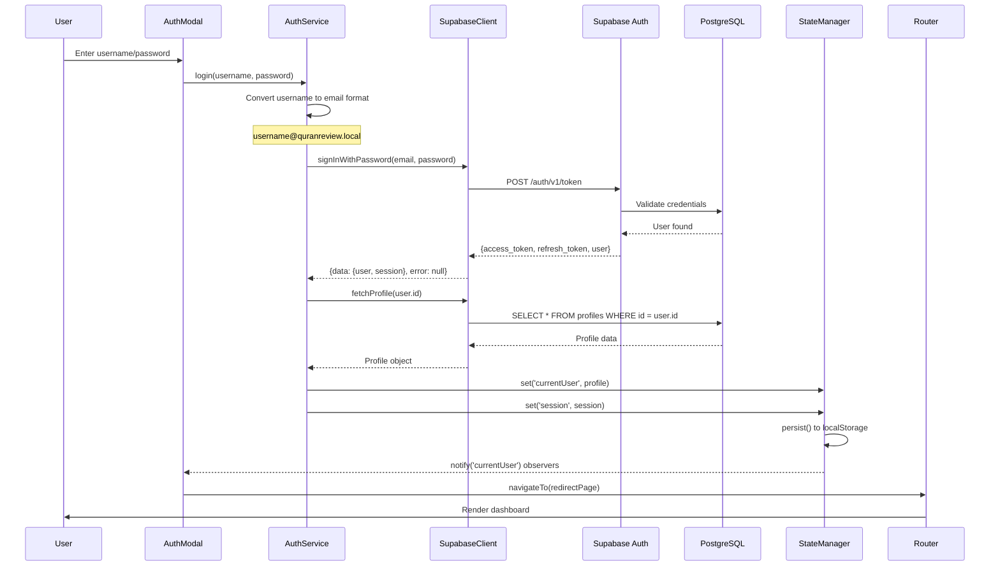
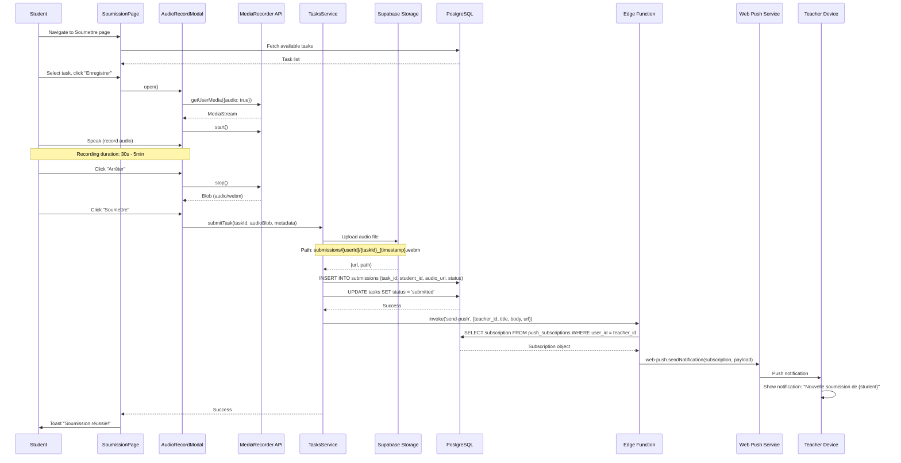
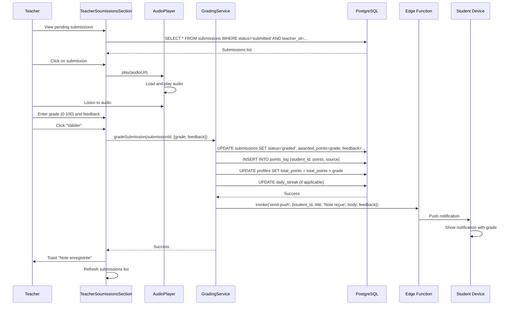
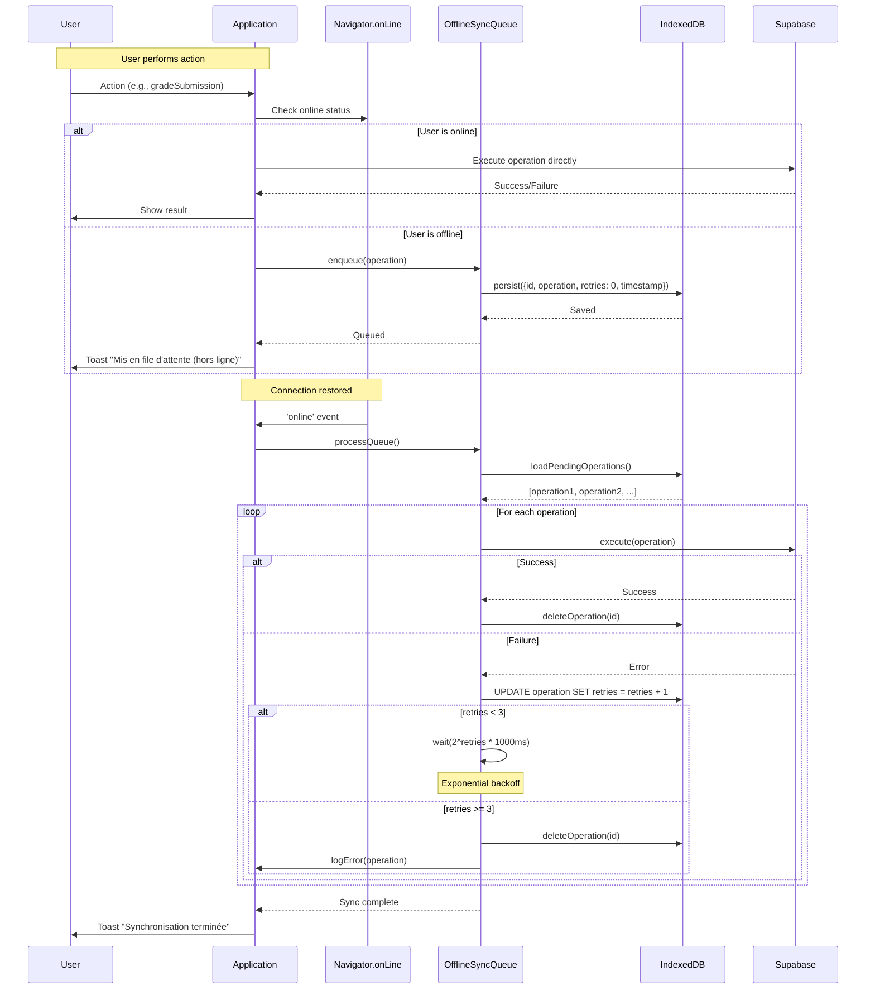
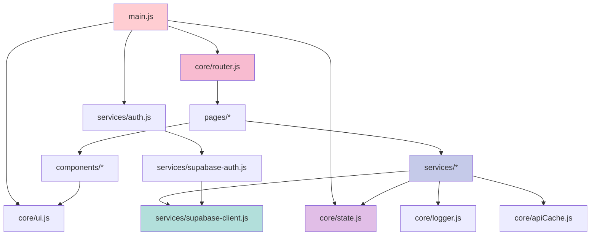

# Architecture Details — QuranReview

**Parent Document:** [design.md](./design.md)

---

## 1. Complete Data Flow Diagrams

### 1.1 User Login Flow



### 1.2 Task Submission Flow (Student)



### 1.3 Grading Flow (Teacher)



### 1.4 Offline Sync Flow



---

## 2. Pattern Implementations

### 2.1 State Manager (Observer Pattern)

```javascript
/**
 * StateManager: Centralized reactive state management
 * Pattern: Observer (Pub/Sub)
 * Location: frontend/src/core/state.js
 */

class StateManager {
  // Private fields
  #state = new Map();
  #subscribers = new Map();
  #persistTimer = null;
  #persistKeys = new Set(['currentUser', 'session', 'theme', 'language', 'settings']);
  
  constructor() {
    this.load();
  }
  
  /**
   * Get state value by key
   * @param {string} key - State key
   * @returns {any} State value or null
   */
  get(key) {
    return this.#state.get(key) ?? null;
  }
  
  /**
   * Set state value and notify subscribers
   * @param {string} key - State key
   * @param {any} value - New value
   */
  set(key, value) {
    const oldValue = this.#state.get(key);
    
    // Check if value actually changed
    if (this.#deepEqual(oldValue, value)) {
      return; // No change, don't notify
    }
    
    this.#state.set(key, value);
    this.#notify(key, value, oldValue);
    
    // Persist if key is marked for persistence
    if (this.#persistKeys.has(key)) {
      this.#schedulePersist();
    }
  }
  
  /**
   * Subscribe to state changes
   * @param {string} key - State key to watch
   * @param {Function} callback - Callback(newValue, oldValue)
   * @returns {Function} Unsubscribe function
   */
  subscribe(key, callback) {
    if (!this.#subscribers.has(key)) {
      this.#subscribers.set(key, new Set());
    }
    
    this.#subscribers.get(key).add(callback);
    
    // Return unsubscribe function
    return () => {
      const callbacks = this.#subscribers.get(key);
      if (callbacks) {
        callbacks.delete(callback);
        if (callbacks.size === 0) {
          this.#subscribers.delete(key);
        }
      }
    };
  }
  
  /**
   * Notify all subscribers of a key
   * @private
   */
  #notify(key, newValue, oldValue) {
    const callbacks = this.#subscribers.get(key);
    if (!callbacks) return;
    
    callbacks.forEach(callback => {
      try {
        callback(newValue, oldValue);
      } catch (error) {
        console.error(`[StateManager] Subscriber error for key "${key}":`, error);
      }
    });
  }
  
  /**
   * Schedule persistence to localStorage (debounced)
   * @private
   */
  #schedulePersist() {
    clearTimeout(this.#persistTimer);
    this.#persistTimer = setTimeout(() => {
      this.persist();
    }, 300); // 300ms debounce
  }
  
  /**
   * Persist state to localStorage
   */
  persist() {
    try {
      const persistData = {};
      this.#persistKeys.forEach(key => {
        const value = this.#state.get(key);
        if (value !== undefined) {
          persistData[key] = value;
        }
      });
      
      localStorage.setItem('quranreview_state', JSON.stringify(persistData));
    } catch (error) {
      console.error('[StateManager] Failed to persist state:', error);
    }
  }
  
  /**
   * Load state from localStorage
   */
  load() {
    try {
      const saved = localStorage.getItem('quranreview_state');
      if (saved) {
        const data = JSON.parse(saved);
        Object.entries(data).forEach(([key, value]) => {
          this.#state.set(key, value);
        });
      }
    } catch (error) {
      console.error('[StateManager] Failed to load state:', error);
    }
  }
  
  /**
   * Deep equality check
   * @private
   */
  #deepEqual(a, b) {
    if (a === b) return true;
    if (a == null || b == null) return false;
    if (typeof a !== 'object' || typeof b !== 'object') return false;
    
    const keysA = Object.keys(a);
    const keysB = Object.keys(b);
    
    if (keysA.length !== keysB.length) return false;
    
    return keysA.every(key => this.#deepEqual(a[key], b[key]));
  }
  
  /**
   * Clear all state (for logout)
   */
  clear() {
    this.#state.clear();
    localStorage.removeItem('quranreview_state');
    this.#notify('*', null, null); // Notify all subscribers
  }
}

// Export singleton instance
export const stateManager = new StateManager();
```

### 2.2 Router (Lazy Loading)

```javascript
/**
 * Router: SPA navigation with lazy loading
 * Pattern: Lazy Initialization + Cache
 * Location: frontend/src/core/router.js
 */

class Router {
  #routes = new Map();
  #moduleCache = new Map();
  #currentRoute = null;
  #listeners = new Set();
  
  constructor() {
    // Listen to browser navigation
    window.addEventListener('popstate', () => this.#handlePopState());
    
    // Intercept link clicks
    document.addEventListener('click', (e) => this.#handleClick(e));
  }
  
  /**
   * Register a route with lazy loader
   * @param {string} path - Route path (e.g., '/home', '/teacher')
   * @param {Function} loader - Async function that returns module
   */
  register(path, loader) {
    this.#routes.set(path, {
      path,
      loader,
      guards: []
    });
  }
  
  /**
   * Add route guard (e.g., auth check)
   * @param {string} path - Route path
   * @param {Function} guard - Guard function returning boolean or Promise<boolean>
   */
  addGuard(path, guard) {
    const route = this.#routes.get(path);
    if (route) {
      route.guards.push(guard);
    }
  }
  
  /**
   * Navigate to a page
   * @param {string} path - Route path
   * @param {Object} params - Query parameters
   */
  async navigateTo(path, params = {}) {
    const route = this.#routes.get(path);
    
    if (!route) {
      console.error(`[Router] Route not found: ${path}`);
      return;
    }
    
    // Run guards
    for (const guard of route.guards) {
      const allowed = await guard();
      if (!allowed) {
        console.warn(`[Router] Navigation to ${path} blocked by guard`);
        return;
      }
    }
    
    // Update browser history
    const url = this.#buildUrl(path, params);
    window.history.pushState({ path, params }, '', url);
    
    // Load and render module
    await this.#loadAndRender(route, params);
  }
  
  /**
   * Load module (with caching)
   * @private
   */
  async #loadAndRender(route, params) {
    try {
      // Check cache first
      let module = this.#moduleCache.get(route.path);
      
      if (!module) {
        // Lazy load module
        console.log(`[Router] Loading module for ${route.path}`);
        module = await route.loader();
        this.#moduleCache.set(route.path, module);
      }
      
      // Render module
      if (module.render) {
        await module.render(params);
      }
      
      // Update current route
      this.#currentRoute = { path: route.path, params };
      
      // Notify listeners
      this.#notifyListeners();
      
    } catch (error) {
      console.error(`[Router] Failed to load route ${route.path}:`, error);
      // TODO: Show error page
    }
  }
  
  /**
   * Build URL with query parameters
   * @private
   */
  #buildUrl(path, params) {
    const query = new URLSearchParams(params).toString();
    return query ? `${path}?${query}` : path;
  }
  
  /**
   * Handle browser back/forward
   * @private
   */
  #handlePopState() {
    const state = window.history.state;
    if (state && state.path) {
      const route = this.#routes.get(state.path);
      if (route) {
        this.#loadAndRender(route, state.params || {});
      }
    }
  }
  
  /**
   * Intercept link clicks for SPA navigation
   * @private
   */
  #handleClick(event) {
    const link = event.target.closest('a[data-page]');
    if (!link) return;
    
    event.preventDefault();
    const page = link.dataset.page;
    const params = JSON.parse(link.dataset.params || '{}');
    this.navigateTo(page, params);
  }
  
  /**
   * Get current route
   * @returns {Object} {path, params}
   */
  getCurrentRoute() {
    return this.#currentRoute;
  }
  
  /**
   * Subscribe to route changes
   * @param {Function} callback - Callback(route)
   * @returns {Function} Unsubscribe function
   */
  onRouteChange(callback) {
    this.#listeners.add(callback);
    return () => this.#listeners.delete(callback);
  }
  
  /**
   * Notify route change listeners
   * @private
   */
  #notifyListeners() {
    this.#listeners.forEach(callback => {
      try {
        callback(this.#currentRoute);
      } catch (error) {
        console.error('[Router] Listener error:', error);
      }
    });
  }
}

// Export singleton instance
export const router = new Router();

// Register routes with lazy loaders
router.register('/home', () => import('../pages/HomePage.js'));
router.register('/teacher', () => import('../pages/TeacherPage.js'));
router.register('/admin', () => import('../pages/AdminPage.js'));
router.register('/hifz', () => import('../pages/HifzPage.js'));
router.register('/ward', () => import('../pages/WardPage.js'));
// ... other routes

// Add auth guard to protected routes
const authGuard = () => {
  const user = stateManager.get('currentUser');
  if (!user) {
    router.navigateTo('/login');
    return false;
  }
  return true;
};

router.addGuard('/home', authGuard);
router.addGuard('/teacher', authGuard);
router.addGuard('/admin', authGuard);
```

### 2.3 Offline Sync Queue (Strategy Pattern)

```javascript
/**
 * OfflineSyncQueue: Queue operations when offline, sync when online
 * Pattern: Strategy + Queue
 * Location: frontend/src/services/offline-sync.js
 */

class OfflineSyncQueue {
  #queue = [];
  #isProcessing = false;
  #db = null; // IndexedDB instance
  
  constructor() {
    this.#initIndexedDB();
    this.#setupOnlineListener();
  }
  
  /**
   * Initialize IndexedDB for persistent queue
   * @private
   */
  async #initIndexedDB() {
    return new Promise((resolve, reject) => {
      const request = indexedDB.open('QuranReviewQueue', 1);
      
      request.onerror = () => reject(request.error);
      request.onsuccess = () => {
        this.#db = request.result;
        this.#loadQueue();
        resolve();
      };
      
      request.onupgradeneeded = (event) => {
        const db = event.target.result;
        if (!db.objectStoreNames.contains('operations')) {
          db.createObjectStore('operations', { keyPath: 'id', autoIncrement: true });
        }
      };
    });
  }
  
  /**
   * Load pending operations from IndexedDB
   * @private
   */
  async #loadQueue() {
    const transaction = this.#db.transaction(['operations'], 'readonly');
    const store = transaction.objectStore('operations');
    const request = store.getAll();
    
    request.onsuccess = () => {
      this.#queue = request.result || [];
      console.log(`[OfflineSync] Loaded ${this.#queue.length} pending operations`);
    };
  }
  
  /**
   * Setup listener for online event
   * @private
   */
  #setupOnlineListener() {
    window.addEventListener('online', () => {
      console.log('[OfflineSync] Connection restored, processing queue');
      this.processQueue();
    });
  }
  
  /**
   * Enqueue an operation
   * @param {Object} operation - {type, method, args}
   */
  async enqueue(operation) {
    const item = {
      operation,
      timestamp: Date.now(),
      retries: 0,
    };
    
    // Add to in-memory queue
    this.#queue.push(item);
    
    // Persist to IndexedDB
    const transaction = this.#db.transaction(['operations'], 'readwrite');
    const store = transaction.objectStore('operations');
    store.add(item);
    
    console.log('[OfflineSync] Operation queued:', operation.type);
  }
  
  /**
   * Process the queue
   */
  async processQueue() {
    if (this.#isProcessing) {
      console.log('[OfflineSync] Already processing');
      return;
    }
    
    if (!navigator.onLine) {
      console.log('[OfflineSync] Still offline, skipping');
      return;
    }
    
    this.#isProcessing = true;
    
    while (this.#queue.length > 0) {
      const item = this.#queue[0];
      
      try {
        await this.#executeOperation(item.operation);
        
        // Success: remove from queue
        this.#queue.shift();
        await this.#removeFromIndexedDB(item.id);
        
        console.log('[OfflineSync] Operation synced:', item.operation.type);
        
      } catch (error) {
        console.error('[OfflineSync] Operation failed:', error);
        
        item.retries++;
        
        if (item.retries >= 3) {
          // Max retries reached, give up
          console.error('[OfflineSync] Max retries reached, discarding:', item.operation);
          this.#queue.shift();
          await this.#removeFromIndexedDB(item.id);
        } else {
          // Exponential backoff
          const delay = Math.pow(2, item.retries) * 1000;
          console.log(`[OfflineSync] Retrying in ${delay}ms`);
          await this.#sleep(delay);
        }
      }
    }
    
    this.#isProcessing = false;
    console.log('[OfflineSync] Queue processing complete');
  }
  
  /**
   * Execute an operation
   * @private
   */
  async #executeOperation(operation) {
    const { type, method, args } = operation;
    
    // Dynamically import the service
    const serviceName = type; // e.g., 'TasksService'
    const service = await import(`./services/${serviceName}.js`);
    
    // Call the method
    if (service[method]) {
      return await service[method](...args);
    } else {
      throw new Error(`Method ${method} not found in ${serviceName}`);
    }
  }
  
  /**
   * Remove operation from IndexedDB
   * @private
   */
  async #removeFromIndexedDB(id) {
    const transaction = this.#db.transaction(['operations'], 'readwrite');
    const store = transaction.objectStore('operations');
    store.delete(id);
  }
  
  /**
   * Sleep utility
   * @private
   */
  #sleep(ms) {
    return new Promise(resolve => setTimeout(resolve, ms));
  }
  
  /**
   * Get queue size
   */
  getQueueSize() {
    return this.#queue.length;
  }
}

// Export singleton instance
export const offlineSyncQueue = new OfflineSyncQueue();
```

---

## 3. Module Dependency Graph



**Dependency Rules:**
1. **No circular dependencies**: Enforced by module organization
2. **Top-down only**: Lower layers cannot import from higher layers
3. **Service isolation**: Services only depend on core modules and Supabase client
4. **Page autonomy**: Pages can import any layer below them

---

## 4. Lazy Loading Algorithm

### Pseudocode

```
ALGORITHM LazyLoadModule(path)
INPUT: path (string) - Route path
OUTPUT: module (object) - Loaded module

BEGIN
  // Check module cache
  IF moduleCache.has(path) THEN
    RETURN moduleCache.get(path)
  END IF
  
  // Find route configuration
  route ← routes.get(path)
  IF route is NULL THEN
    THROW Error("Route not found")
  END IF
  
  // Execute loader (dynamic import)
  TRY
    startTime ← performance.now()
    module ← AWAIT route.loader()
    endTime ← performance.now()
    loadTime ← endTime - startTime
    
    // Log performance
    logger.info(`Module ${path} loaded in ${loadTime}ms`)
    
    // Cache module
    moduleCache.set(path, module)
    
    RETURN module
    
  CATCH error
    logger.error(`Failed to load module ${path}:`, error)
    // Show error page
    RETURN errorModule
  END TRY
END
```

### Performance Characteristics

- **First Load:** ~100-300ms (network + parse)
- **Cached Load:** <1ms (memory lookup)
- **Bundle Size Reduction:** ~60% (vs. loading all pages upfront)

**Example:**
- Without lazy loading: 200KB initial bundle
- With lazy loading: 80KB initial + 120KB on-demand

---

**Next Module:** [design-components.md](./design-components.md)

