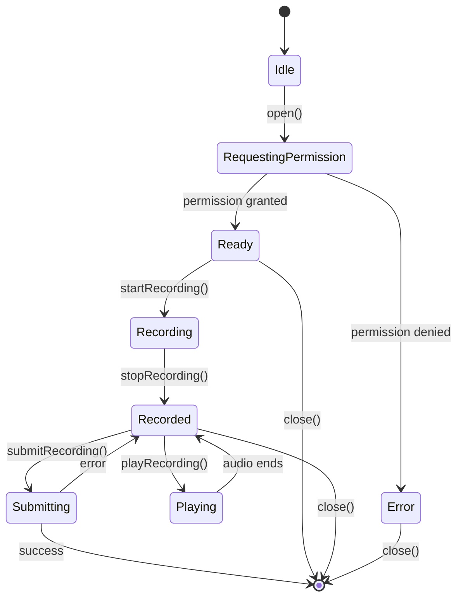

# Component & Interface Specifications — QuranReview

**Parent Document:** [design.md](./design.md)

---

## 1. Core Components

### 1.1 StateManager

**File:** `frontend/src/core/state.js`  
**Pattern:** Observer (Pub/Sub)  
**Responsibility:** Centralized reactive state management

**Interface:**
```typescript
interface StateManager {
  // Get state value
  get<T>(key: string): T | null;
  
  // Set state value and notify subscribers
  set<T>(key: string, value: T): void;
  
  // Subscribe to changes on a key
  subscribe(key: string, callback: (newValue: any, oldValue: any) => void): () => void;
  
  // Persist state to localStorage
  persist(): void;
  
  // Load state from localStorage
  load(): void;
  
  // Clear all state
  clear(): void;
}
```

**Usage Example:**
```javascript
import { stateManager } from './core/state.js';

// Set value
stateManager.set('currentUser', { id: 1, username: 'ahmed' });

// Get value
const user = stateManager.get('currentUser');

// Subscribe to changes
const unsubscribe = stateManager.subscribe('currentUser', (newUser, oldUser) => {
  console.log('User changed:', oldUser, '->', newUser);
  updateUI(newUser);
});

// Later: unsubscribe
unsubscribe();
```

**Implementation Details:** See [design-architecture.md §2.1](./design-architecture.md#21-state-manager-observer-pattern)

---

### 1.2 Router

**File:** `frontend/src/core/router.js`  
**Pattern:** Lazy Initialization + Cache  
**Responsibility:** SPA navigation with lazy loading

**Interface:**
```typescript
interface Router {
  // Register a route with lazy loader
  register(path: string, loader: () => Promise<Module>): void;
  
  // Add route guard (e.g., auth check)
  addGuard(path: string, guard: () => boolean | Promise<boolean>): void;
  
  // Navigate to a page
  navigateTo(path: string, params?: Record<string, any>): Promise<void>;
  
  // Get current route
  getCurrentRoute(): { path: string; params: Record<string, any> };
  
  // Subscribe to route changes
  onRouteChange(callback: (route: Route) => void): () => void;
}
```

**Usage Example:**
```javascript
import { router } from './core/router.js';

// Register routes
router.register('/home', () => import('./pages/HomePage.js'));
router.register('/teacher', () => import('./pages/TeacherPage.js'));

// Add auth guard
router.addGuard('/teacher', () => {
  const user = stateManager.get('currentUser');
  return user && user.role === 'teacher';
});

// Navigate
await router.navigateTo('/teacher', { tab: 'students' });

// Listen to route changes
router.onRouteChange((route) => {
  console.log('Route changed to:', route.path);
});
```

**Implementation Details:** See [design-architecture.md §2.2](./design-architecture.md#22-router-lazy-loading)

---

### 1.3 UI Utilities

**File:** `frontend/src/core/ui.js`  
**Pattern:** Factory  
**Responsibility:** UI helpers (modals, toasts, skeletons, loaders)

**Interface:**
```typescript
interface UI {
  // Modal management
  createModal(options: ModalOptions): Modal;
  closeModal(modalId: string): void;
  
  // Toast notifications
  showToast(message: string, type: 'success' | 'error' | 'info' | 'warning', duration?: number): void;
  
  // Loading indicators
  showLoader(containerId: string): void;
  hideLoader(containerId: string): void;
  
  // Skeleton screens
  showSkeleton(containerId: string, type: 'list' | 'card' | 'text'): void;
  hideSkeleton(containerId: string): void;
  
  // Confirm dialog
  confirm(message: string): Promise<boolean>;
}

interface ModalOptions {
  title: string;
  content: string | HTMLElement;
  actions?: Array<{ label: string; onClick: () => void; primary?: boolean }>;
  closable?: boolean;
  size?: 'sm' | 'md' | 'lg';
}
```

**Usage Example:**
```javascript
import { UI } from './core/ui.js';

// Show toast
UI.showToast('Soumission réussie !', 'success', 3000);

// Show loader
UI.showLoader('#submissions-container');
await fetchSubmissions();
UI.hideLoader('#submissions-container');

// Create modal
const modal = UI.createModal({
  title: 'Confirmer la suppression',
  content: 'Êtes-vous sûr de vouloir supprimer cette tâche ?',
  actions: [
    { label: 'Annuler', onClick: () => UI.closeModal(modal.id) },
    { label: 'Supprimer', onClick: () => deleteTask(), primary: true }
  ]
});

// Confirm dialog
const confirmed = await UI.confirm('Supprimer cet utilisateur ?');
if (confirmed) {
  deleteUser();
}
```

---

### 1.4 API Cache

**File:** `frontend/src/core/apiCache.js`  
**Pattern:** Strategy  
**Responsibility:** In-memory API response caching with TTL

**Interface:**
```typescript
interface APICache {
  // Get cached value
  get(key: string): any | null;
  
  // Set cached value with TTL
  set(key: string, value: any, ttl?: number): void;
  
  // Invalidate cache key
  invalidate(key: string): void;
  
  // Invalidate all keys matching pattern
  invalidatePattern(pattern: RegExp): void;
  
  // Clear entire cache
  clear(): void;
}
```

**Usage Example:**
```javascript
import { apiCache } from './core/apiCache.js';

// Check cache first
const cacheKey = `tasks_${userId}`;
let tasks = apiCache.get(cacheKey);

if (!tasks) {
  // Cache miss: fetch from API
  tasks = await supabase.from('tasks').select('*').eq('user_id', userId);
  
  // Cache for 5 minutes
  apiCache.set(cacheKey, tasks, 5 * 60 * 1000);
}

return tasks;
```

**Implementation:**
```javascript
class APICache {
  #cache = new Map();
  
  get(key) {
    const entry = this.#cache.get(key);
    if (!entry) return null;
    
    // Check if expired
    if (Date.now() > entry.expiresAt) {
      this.#cache.delete(key);
      return null;
    }
    
    return entry.value;
  }
  
  set(key, value, ttl = 5 * 60 * 1000) { // Default 5min
    this.#cache.set(key, {
      value,
      expiresAt: Date.now() + ttl
    });
  }
  
  invalidate(key) {
    this.#cache.delete(key);
  }
  
  invalidatePattern(pattern) {
    for (const key of this.#cache.keys()) {
      if (pattern.test(key)) {
        this.#cache.delete(key);
      }
    }
  }
  
  clear() {
    this.#cache.clear();
  }
}

export const apiCache = new APICache();
```

---

## 2. Service Interfaces

### 2.1 Authentication Service

**File:** `frontend/src/services/auth.js`

**Interface:**
```typescript
interface AuthService {
  // Login with username/password
  login(username: string, password: string): Promise<{ user: User; session: Session }>;
  
  // Logout
  logout(): Promise<void>;
  
  // Get current session
  getSession(): Promise<Session | null>;
  
  // Check if user is authenticated
  isAuthenticated(): boolean;
  
  // Refresh session
  refreshSession(): Promise<Session>;
}
```

---

### 2.2 Tasks Service

**File:** `frontend/src/services/tasks.js`

**Interface:**
```typescript
interface TasksService {
  // Get all tasks for current user
  getAll(filters?: { status?: string; type?: string }): Promise<Task[]>;
  
  // Get task by ID
  getById(id: string): Promise<Task>;
  
  // Create task (teacher/admin only)
  create(payload: CreateTaskPayload): Promise<Task>;
  
  // Update task
  update(id: string, payload: Partial<Task>): Promise<Task>;
  
  // Delete task
  delete(id: string): Promise<void>;
  
  // Submit audio for task (student)
  submitTask(taskId: string, audioBlob: Blob, metadata: any): Promise<Submission>;
}

interface CreateTaskPayload {
  title: string;
  description: string;
  type: 'hifz' | 'muraja' | 'tilawa';
  assigned_to: string; // user_id or class_id
  due_date?: string;
  points: number;
  surah_id?: number;
  ayah_start?: number;
  ayah_end?: number;
}
```

---

### 2.3 Push Notifications Service

**File:** `frontend/src/services/push-notifications.js`

**Interface:**
```typescript
interface PushNotificationsService {
  // Check if notifications are supported
  isSupported(): boolean;
  
  // Check current permission status
  getPermission(): NotificationPermission;
  
  // Request permission and subscribe
  subscribe(): Promise<PushSubscription>;
  
  // Unsubscribe from push notifications
  unsubscribe(): Promise<void>;
  
  // Save subscription to database
  saveSubscription(subscription: PushSubscription): Promise<void>;
  
  // Send test notification
  sendTestNotification(): Promise<void>;
}
```

**Usage Example:**
```javascript
import { PushNotificationsService } from './services/push-notifications.js';

// Check support
if (PushNotificationsService.isSupported()) {
  // Request permission
  const subscription = await PushNotificationsService.subscribe();
  
  // Save to database
  await PushNotificationsService.saveSubscription(subscription);
  
  console.log('Push notifications enabled');
}
```

---

### 2.4 Analytics Service

**File:** `frontend/src/services/analytics.js`

**Interface:**
```typescript
interface AnalyticsService {
  // Get points evolution over time
  getPointsEvolution(userId: string, days: number): Promise<ChartData>;
  
  // Get memorization statistics
  getMemorizationStats(userId: string): Promise<MemorizationStats>;
  
  // Get daily streak
  getDailyStreak(userId: string): Promise<number>;
  
  // Get leaderboard
  getLeaderboard(limit?: number): Promise<LeaderboardEntry[]>;
  
  // Export user data
  exportUserData(userId: string, format: 'json' | 'csv'): Promise<Blob>;
}

interface ChartData {
  labels: string[]; // Dates
  datasets: Array<{
    label: string;
    data: number[];
    backgroundColor?: string;
    borderColor?: string;
  }>;
}

interface MemorizationStats {
  totalSurahs: number;
  completedSurahs: number;
  totalAyahs: number;
  memorizedAyahs: number;
  percentageComplete: number;
  bySurah: Array<{
    surahId: number;
    surahName: string;
    progress: number;
  }>;
}
```

---

## 3. Component Specifications

### 3.1 AudioRecordModal

**File:** `frontend/src/components/AudioRecordModal.js`

**Responsibility:** Record audio from microphone for task submissions

**Interface:**
```typescript
interface AudioRecordModal {
  // Open modal
  open(taskId: string, taskTitle: string): void;
  
  // Close modal
  close(): void;
  
  // Start recording
  startRecording(): Promise<void>;
  
  // Stop recording
  stopRecording(): void;
  
  // Play recorded audio
  playRecording(): void;
  
  // Submit recording
  submitRecording(): Promise<void>;
  
  // Events
  on(event: 'submitted' | 'cancelled', handler: () => void): void;
}
```

**State Machine:**


**Algorithm: Record Audio**
```
ALGORITHM RecordAudio()
BEGIN
  // Request microphone permission
  TRY
    stream ← AWAIT navigator.mediaDevices.getUserMedia({audio: true})
  CATCH error
    SHOW error "Microphone permission denied"
    RETURN
  END TRY
  
  // Create MediaRecorder
  recorder ← NEW MediaRecorder(stream, {mimeType: 'audio/webm'})
  chunks ← []
  
  // Collect audio chunks
  recorder.ondataavailable ← (event) => {
    chunks.push(event.data)
  }
  
  // Start recording
  recorder.start()
  startTime ← Date.now()
  
  // Update UI timer every second
  WHILE recording DO
    elapsed ← (Date.now() - startTime) / 1000
    UPDATE UI timer with elapsed
    WAIT 1 second
  END WHILE
  
  // Stop recording
  recorder.stop()
  
  // Create blob
  recorder.onstop ← () => {
    audioBlob ← NEW Blob(chunks, {type: 'audio/webm'})
    RETURN audioBlob
  }
END
```

---

### 3.2 WeekCalendar

**File:** `frontend/src/components/WeekCalendar.js`

**Responsibility:** Display weekly view of tasks

**Interface:**
```typescript
interface WeekCalendar {
  // Render calendar for a specific week
  render(containerId: string, startDate: Date): void;
  
  // Navigate to previous week
  previousWeek(): void;
  
  // Navigate to next week
  nextWeek(): void;
  
  // Go to today's week
  goToToday(): void;
  
  // Refresh tasks
  refresh(): Promise<void>;
  
  // Events
  on(event: 'taskClick', handler: (task: Task) => void): void;
}
```

**Algorithm: Render Week**
```
ALGORITHM RenderWeek(startDate)
INPUT: startDate (Date) - First day of week
OUTPUT: HTML calendar structure

BEGIN
  // Calculate week range
  endDate ← startDate + 6 days
  
  // Fetch tasks for this week
  tasks ← AWAIT TasksService.getAll({
    start_date: startDate,
    end_date: endDate
  })
  
  // Group tasks by date
  tasksByDate ← MAP()
  FOR EACH task IN tasks DO
    date ← task.due_date
    IF NOT tasksByDate.has(date) THEN
      tasksByDate.set(date, [])
    END IF
    tasksByDate.get(date).push(task)
  END FOR
  
  // Render calendar grid
  html ← '<div class="week-calendar">'
  
  // Render days
  currentDate ← startDate
  WHILE currentDate <= endDate DO
    dayTasks ← tasksByDate.get(currentDate) OR []
    isToday ← currentDate == TODAY
    
    html += `
      <div class="calendar-day ${isToday ? 'today' : ''}">
        <div class="day-header">
          <span class="day-name">${getDayName(currentDate)}</span>
          <span class="day-number">${currentDate.getDate()}</span>
        </div>
        <div class="day-tasks">
    `
    
    // Render tasks for this day
    FOR EACH task IN dayTasks DO
      statusClass ← getStatusClass(task.status)
      html += `
        <div class="task-item ${statusClass}" data-task-id="${task.id}">
          <span class="task-title">${task.title}</span>
          <span class="task-points">${task.points}pts</span>
        </div>
      `
    END FOR
    
    html += `
        </div>
      </div>
    `
    
    currentDate ← currentDate + 1 day
  END WHILE
  
  html += '</div>'
  
  // Inject HTML
  document.querySelector(containerId).innerHTML = html
  
  // Attach event listeners
  attachTaskClickListeners()
END
```

---

### 3.3 AudioPlayer

**File:** `frontend/src/components/AudioPlayer.js`

**Responsibility:** Play audio files (Ward recitation, submissions)

**Interface:**
```typescript
interface AudioPlayer {
  // Load audio file
  load(url: string): Promise<void>;
  
  // Play audio
  play(): void;
  
  // Pause audio
  pause(): void;
  
  // Stop audio
  stop(): void;
  
  // Seek to position
  seek(seconds: number): void;
  
  // Set playback rate
  setPlaybackRate(rate: number): void; // 0.5, 1.0, 1.5, 2.0
  
  // Get current time
  getCurrentTime(): number;
  
  // Get duration
  getDuration(): number;
  
  // Events
  on(event: 'play' | 'pause' | 'ended' | 'timeupdate', handler: () => void): void;
}
```

---

## 4. Design System Components

### 4.1 Button Variants

**CSS Classes:**
```css
.btn              /* Base button */
.btn-primary      /* Primary action */
.btn-secondary    /* Secondary action */
.btn-danger       /* Destructive action */
.btn-success      /* Success action */
.btn-sm           /* Small button */
.btn-lg           /* Large button */
.btn-icon         /* Icon-only button */
.btn-loading      /* Loading state */
```

**Usage:**
```html
<button class="btn btn-primary">Soumettre</button>
<button class="btn btn-secondary btn-sm">Annuler</button>
<button class="btn btn-danger">Supprimer</button>
<button class="btn btn-icon" aria-label="Menu">
  <svg>...</svg>
</button>
```

### 4.2 Card Component

**CSS Classes:**
```css
.card             /* Base card */
.card-header      /* Card header */
.card-body        /* Card content */
.card-footer      /* Card footer */
.card-elevated    /* Elevated shadow */
.card-bordered    /* Border style */
```

**Usage:**
```html
<div class="card card-elevated">
  <div class="card-header">
    <h3>Titre</h3>
  </div>
  <div class="card-body">
    Contenu
  </div>
  <div class="card-footer">
    <button class="btn btn-primary">Action</button>
  </div>
</div>
```

### 4.3 Modal Component

**CSS Classes:**
```css
.modal            /* Modal overlay */
.modal-dialog     /* Modal container */
.modal-sm         /* Small modal */
.modal-lg         /* Large modal */
.modal-header     /* Modal header */
.modal-body       /* Modal content */
.modal-footer     /* Modal actions */
```

---

## 5. Accessibility Compliance

### 5.1 ARIA Labels

All interactive elements MUST have accessible labels:

```html
<!-- Buttons with icons -->
<button class="btn btn-icon" aria-label="Fermer">
  <svg aria-hidden="true">...</svg>
</button>

<!-- Form inputs -->
<label for="username">Nom d'utilisateur</label>
<input id="username" type="text" aria-required="true">

<!-- Modal -->
<div class="modal" role="dialog" aria-labelledby="modal-title" aria-modal="true">
  <h2 id="modal-title">Titre du modal</h2>
  ...
</div>
```

### 5.2 Keyboard Navigation

All interactive elements MUST be keyboard accessible:

| Element | Key | Action |
|---------|-----|--------|
| Buttons | Enter / Space | Activate |
| Modals | Escape | Close |
| Lists | Arrow keys | Navigate items |
| Tabs | Arrow keys | Switch tabs |
| Forms | Tab | Focus next field |

**Implementation:**
```javascript
// Trap focus in modal
function trapFocus(modal) {
  const focusableElements = modal.querySelectorAll(
    'button, [href], input, select, textarea, [tabindex]:not([tabindex="-1"])'
  );
  const firstElement = focusableElements[0];
  const lastElement = focusableElements[focusableElements.length - 1];
  
  modal.addEventListener('keydown', (e) => {
    if (e.key === 'Tab') {
      if (e.shiftKey && document.activeElement === firstElement) {
        e.preventDefault();
        lastElement.focus();
      } else if (!e.shiftKey && document.activeElement === lastElement) {
        e.preventDefault();
        firstElement.focus();
      }
    } else if (e.key === 'Escape') {
      closeModal();
    }
  });
}
```

### 5.3 Color Contrast

All text MUST meet WCAG 2.1 AA contrast ratios:

- **Normal text (< 18pt):** Minimum 4.5:1
- **Large text (≥ 18pt or ≥ 14pt bold):** Minimum 3:1

**Design System Compliance:**
```css
:root {
  /* Compliant color pairs */
  --text-primary: #212121;      /* on white: 16.1:1 ✓ */
  --text-secondary: #757575;    /* on white: 4.6:1 ✓ */
  --accent-green: #2e7d32;      /* on white: 4.9:1 ✓ */
  --danger: #c62828;            /* on white: 6.4:1 ✓ */
}
```

---

**Next Module:** [design-data.md](./design-data.md)

