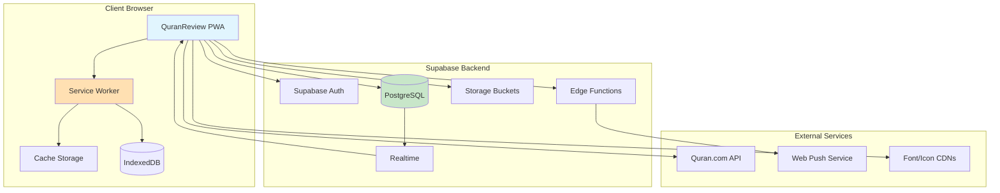
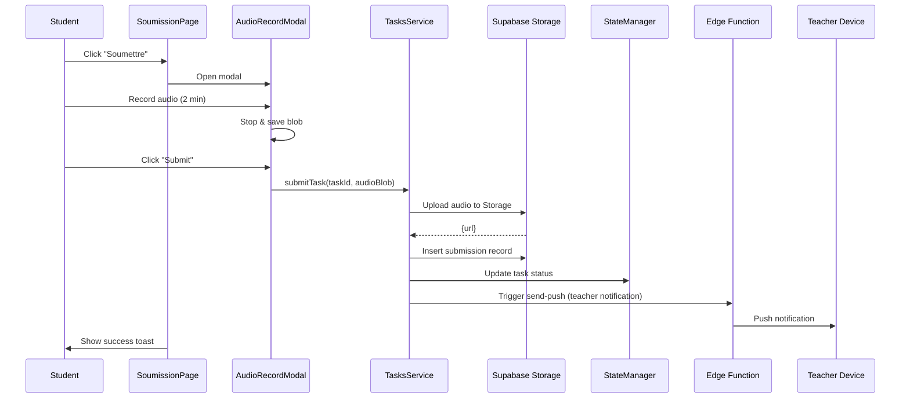
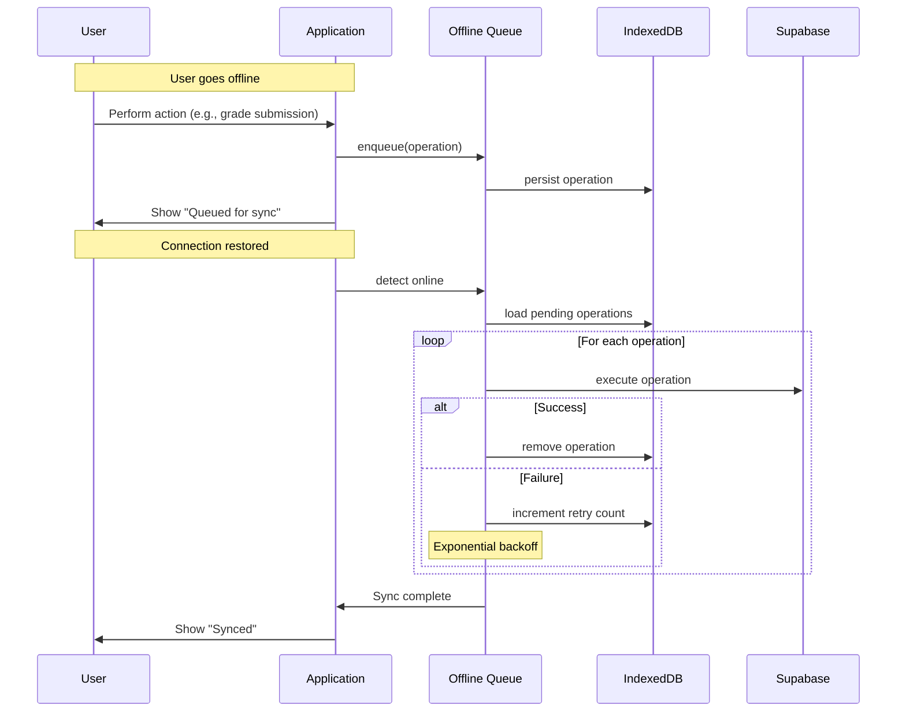

# Design Document — QuranReview Amélioration Complète

**Version:** 1.0  
**Date:** 2024  
**Status:** Draft  
**Workflow:** Requirements-First

---

## Document Structure

This design document is organized into modular files for better navigation and maintainability:

1. **[design.md](./design.md)** (this file) - Overview and master document
2. **[design-architecture.md](./design-architecture.md)** - System architecture, layers, patterns, data flows
3. **[design-components.md](./design-components.md)** - Component design, interfaces, algorithms
4. **[design-data.md](./design-data.md)** - Data models, database schema, APIs
5. **[design-security-performance.md](./design-security-performance.md)** - Security measures, performance strategy
6. **[design-testing.md](./design-testing.md)** - Testing strategy, correctness properties, PBT approach

---

## 1. Overview

### 1.1 Purpose and Scope

This design document specifies the technical architecture and implementation strategy for the comprehensive improvement of **QuranReview**, a Progressive Web Application (PWA) for Quranic memorization and learning.

**Target Users:**
- **Students** (role: `student`): Memorize, revise, submit audio recordings, track progress
- **Teachers** (role: `teacher`): Create tasks, grade submissions, manage classes
- **Administrators** (role: `admin`): Manage users, classes, system configuration

**Scope:** 10 strategic improvement categories with 167 acceptance criteria covering:
- Architecture Modulaire (10 criteria)
- Design System (10 criteria)  
- Tests Automatisés (12 criteria)
- Performance et Optimisation (14 criteria)
- Expérience Utilisateur (16 criteria)
- Fonctionnalités Manquantes (20 criteria)
- Sécurité et Robustesse (16 criteria)
- DevOps et Workflow (15 criteria)
- Base de Données (15 criteria)
- Design UI/UX Avancé (16 criteria)

### 1.2 System Context

**Current State:**
- **Frontend:** Vanilla JavaScript (ES Modules), CSS custom properties, Service Worker
- **Backend:** Supabase (Auth, PostgreSQL, Storage, Edge Functions)
- **Deployment:** Vercel (static site hosting)
- **Recent Migration:** Django → Supabase completed (-9,168 lines removed)

**Technical Constraints:**
- **MUST:** Maintain Vanilla JS (no React/Vue/Svelte framework)
- **MUST:** Use Supabase as backend (no custom Node.js server)
- **MUST:** Preserve backward compatibility with existing database schema
- **SHOULD:** Prioritize native and lightweight solutions
- **SHOULD:** Improve progressively without big bang rewrite

**Success Metrics (KPIs):**
- Lighthouse Performance ≥ 90
- Code coverage ≥ 80%
- LCP < 2.5s, FID < 100ms, CLS < 0.1
- WCAG 2.1 AA accessibility compliance
- Bundle size reduction 30%

### 1.3 Design Goals

1. **Modularity:** Clear separation of concerns with layered architecture
2. **Performance:** Code splitting, lazy loading, aggressive caching
3. **Testability:** Property-based testing for critical logic
4. **Accessibility:** WCAG 2.1 AA compliance with keyboard navigation
5. **Security:** Defense in depth with validation, CSP, RLS policies
6. **Maintainability:** Well-documented, low complexity (≤10 per function)

### 1.4 Key Design Principles

1. **Separation of Concerns**: Clear boundaries between presentation, business logic, data access
2. **Progressive Enhancement**: Core functionality works without advanced features
3. **Performance First**: Optimize for Core Web Vitals (LCP, FID, CLS)
4. **Accessibility by Default**: ARIA labels, semantic HTML, keyboard navigation
5. **Testability**: Design for both property-based and example-based testing
6. **Security in Depth**: Client validation + server enforcement + RLS policies

---

## 2. High-Level Architecture Overview

### 2.1 System Context Diagram



### 2.2 Layered Architecture

The application follows strict layered architecture:

```
┌──────────────────────────────────────┐
│    Presentation Layer (Pages)        │  → User-facing pages
├──────────────────────────────────────┤
│    Component Layer (Reusable UI)     │  → Reusable components
├──────────────────────────────────────┤
│    Business Logic Layer (Services)   │  → Domain logic
├──────────────────────────────────────┤
│    Core Layer (Infrastructure)       │  → Router, State, Logger
├──────────────────────────────────────┤
│    Infrastructure (Supabase, APIs)   │  → External services
└──────────────────────────────────────┘
```

**Key Benefits:**
- Clear dependency direction (top → bottom only)
- Each layer testable in isolation
- Prevents circular dependencies
- Enables lazy loading by layer

### 2.3 Module Organization

```
frontend/src/
├── core/          # Infrastructure (router, state, ui, logger, config, apiCache)
├── components/    # Reusable UI (AudioPlayer, AuthModal, WeekCalendar, etc.)
├── services/      # Business logic (auth, tasks, hifz, push-notifications, analytics)
├── pages/         # Page components (HomePage, TeacherPage, AdminPage, etc.)
└── main.js        # Application entry point
```

**Design Patterns Applied:**
- **Module Pattern** (encapsulation)
- **Observer Pattern** (state management)
- **Factory Pattern** (component creation)
- **Strategy Pattern** (cache strategies)
- **Dependency Injection** (services)
- **Facade Pattern** (complex API simplification)

---

## 3. Core Components Summary

### 3.1 StateManager (core/state.js)

**Responsibility:** Centralized reactive state management

**Interface:**
```typescript
interface StateManager {
  get<T>(key: string): T | null;
  set<T>(key: string, value: T): void;
  subscribe(key: string, callback: (value: T) => void): () => void;
  persist(): void;
  load(): void;
}
```

**Key Features:**
- Pub/sub pattern for reactive updates
- Automatic localStorage persistence (debounced 300ms)
- Type-safe getters/setters
- Unsubscribe support

### 3.2 Router (core/router.js)

**Responsibility:** SPA navigation with lazy loading

**Interface:**
```typescript
interface Router {
  navigateTo(page: string, params?: Record<string, any>): void;
  getCurrentRoute(): Route;
  onRouteChange(callback: (route: Route) => void): () => void;
  lazy(loader: () => Promise<Module>): Promise<Module>;
}
```

**Key Features:**
- History API integration
- Lazy module loading (cache modules once loaded)
- Route guards (auth check)
- Query parameter support

### 3.3 DesignSystem (CSS custom properties)

**Responsibility:** Centralized design tokens and component styles

**Structure:**
- `ds-tokens.css`: Colors, spacing, typography, shadows, transitions
- `ds-components.css`: Buttons, cards, modals, badges, progress bars
- Theme switching: `[data-theme="light|dark"]`

**Key Tokens:**
- Spacing scale: 0.25rem, 0.5rem, 0.75rem, 1rem, 1.5rem, 2rem, 3rem
- Semantic colors: success, warning, danger, info, accent-green
- Border-radius: 4px, 8px, 12px, 16px, 999px
- Shadow elevation: sm, md, lg, xl

### 3.4 Service Worker (sw.js)

**Responsibility:** Offline support and intelligent caching

**Cache Strategies:**
- Static assets (CSS, JS, fonts): **cache-first**
- API responses: **stale-while-revalidate** (5min TTL)
- Audio files: **cache-on-demand**
- Offline queue: IndexedDB for deferred actions

### 3.5 Notification System (services/push-notifications.js + Edge Function)

**Responsibility:** Web Push notifications

**Components:**
- Frontend: Subscription manager (VAPID)
- Edge Function: `send-push` (Deno, web-push library)
- Database: `push_subscriptions` table

**Flow:**
1. User enables notifications → subscribe to Web Push API
2. Store subscription in Supabase
3. Teacher grades submission → trigger Edge Function
4. Edge Function sends push to student's device

### 3.6 Analytics Engine (services/analytics.js)

**Responsibility:** Data aggregation and visualization

**Features:**
- Chart.js integration for interactive charts
- Daily points evolution (30-day view)
- Cumulative points graph
- Per-surah memorization statistics
- Streak calculation and animation
- CSV/JSON export capability

---

## 4. Data Flow Examples

### 4.1 Task Submission Flow



### 4.2 Offline Sync Flow



---

## 5. Security Architecture

### 5.1 Defense in Depth Strategy

```
┌─────────────────────────────────────────┐
│  Browser Security (CSP, HTTPS)          │
├─────────────────────────────────────────┤
│  Client Validation (Input sanitization) │
├─────────────────────────────────────────┤
│  Supabase Auth (JWT tokens)             │
├─────────────────────────────────────────┤
│  Row Level Security (RLS policies)      │
├─────────────────────────────────────────┤
│  Database Constraints (NOT NULL, CHECK) │
└─────────────────────────────────────────┘
```

**Key Security Measures:**
1. **Content Security Policy (CSP)** headers to prevent XSS
2. **Input validation** on client and server
3. **HTML sanitization** for user-generated content
4. **Rate limiting** in Edge Functions (100 req/min/user)
5. **RLS policies** to enforce data access rules
6. **Secret management** via environment variables
7. **HTTPS enforcement** in production

### 5.2 Row Level Security (RLS) Policies

**Students:** Access only own data
```sql
CREATE POLICY "students_own_data" ON tasks
    FOR SELECT USING (auth.uid() = user_id);
```

**Teachers:** Access assigned students only
```sql
CREATE POLICY "teachers_assigned_students" ON tasks
    FOR SELECT USING (
        auth.uid() IN (
            SELECT teacher_id FROM classes c
            JOIN class_members cm ON c.id = cm.class_id
            WHERE cm.student_id = tasks.user_id
        )
    );
```

**Admins:** Full access
```sql
CREATE POLICY "admins_all_access" ON tasks
    FOR ALL USING (
        (SELECT role FROM profiles WHERE id = auth.uid()) = 'admin'
    );
```

---

## 6. Performance Strategy

### 6.1 Core Web Vitals Targets

| Metric | Target | Strategy |
|--------|--------|----------|
| **LCP** (Largest Contentful Paint) | < 2.5s | Lazy load images, preload critical CSS/fonts, code splitting |
| **FID** (First Input Delay) | < 100ms | Minimize main thread work, debounce inputs (300ms) |
| **CLS** (Cumulative Layout Shift) | < 0.1 | Reserve space for images, avoid layout shifts |

### 6.2 Optimization Techniques

1. **Code Splitting:** Lazy load pages >50KB
2. **Image Optimization:** WebP format, `loading="lazy"`, responsive srcset
3. **Asset Compression:** Gzip/Brotli in production
4. **Resource Prioritization:** Preload critical resources (`<link rel="preload">`)
5. **API Caching:** In-memory cache with TTL (5min default)
6. **Bundle Optimization:** Separate vendor chunks (Supabase, Chart.js)
7. **Service Worker Caching:** Aggressive caching for static assets

### 6.3 Bundle Strategy

```
main.js           (core + router + state)       ~30KB
vendor-supabase.js (Supabase client)            ~50KB
vendor-chart.js    (Chart.js)                   ~40KB
page-admin.js      (Admin page + sections)      ~45KB  [lazy]
page-teacher.js    (Teacher page + sections)    ~40KB  [lazy]
page-student.js    (Student pages bundle)       ~60KB  [lazy]
```

**Total Initial Load:** ~80KB (main + vendor-supabase only)  
**Lazy Loaded:** ~145KB (loaded on-demand by role)

---

## 7. Testing Strategy Overview

### 7.1 Test Pyramid

```
        /\
       /  \       E2E Tests (Playwright)         ~10% coverage
      /____\      Critical user flows
     /      \     
    /        \    Integration Tests (Vitest)     ~20% coverage
   /__________\   Supabase client interactions
  /            \  
 /              \ Unit Tests (Vitest)             ~70% coverage
/________________\ Services, utils, core modules
```

### 7.2 Property-Based Testing Approach

**Applicability Assessment:**

✅ **PBT IS appropriate for:**
- State management (get/set round-trip, observer notification)
- Data transformations (serialization, parsing)
- Validation logic (input validators)
- Business logic (points calculation, streak computation)
- Pure functions with clear input/output

❌ **PBT is NOT appropriate for:**
- UI rendering (use snapshot tests instead)
- Supabase integration (use example-based integration tests)
- Edge Functions calling external services (use mocks + examples)
- Configuration validation (use schema validation)

**Testing Library:** `@fast-check/vitest` for property-based tests

**Configuration:** Minimum 100 iterations per property test

### 7.3 Test Organization

```
tests/
├── unit/
│   ├── core/           (state-manager, router, api-cache)
│   ├── services/       (auth, tasks, competition, hifz)
│   └── utils/          (validators, formatters)
├── integration/
│   ├── supabase-client.test.js
│   ├── offline-sync.test.js
│   └── push-notifications.test.js
└── e2e/
    ├── login.spec.js
    ├── task-submission.spec.js
    └── grading.spec.js
```

---

## 8. Implementation Roadmap

### Phase 1: Foundations (Weeks 1-4)
- Setup test infrastructure (Vitest + Playwright)
- Implement Design System (tokens + components)
- Configure CI/CD pipeline
- Add ESLint + Prettier + pre-commit hooks

### Phase 2: Architecture (Weeks 5-8)
- Refactor state management with pub/sub
- Implement lazy loading for large pages
- Add dependency injection for services
- Optimize bundle with code splitting

### Phase 3: Features (Weeks 9-12)
- Implement push notifications
- Add analytics dashboard with Chart.js
- Implement offline sync queue
- Add weekly calendar component

### Phase 4: Polish (Weeks 13-16)
- Accessibility audit and fixes (WCAG 2.1 AA)
- Performance optimization (Lighthouse >90)
- UI/UX enhancements (animations, micro-interactions)
- i18n multi-language support

---

## 9. Requirements Traceability Matrix

| Requirement | Design Components | Design Sections |
|-------------|-------------------|-----------------|
| Req 1: Architecture Modulaire | StateManager, Router, Module Organization | §3, §4, design-architecture.md |
| Req 2: Design System | DesignSystem, CSS tokens/components | §3.3, design-components.md |
| Req 3: Tests Automatisés | Test Strategy, PBT approach | §7, design-testing.md |
| Req 4: Performance | Bundle Strategy, Service Worker | §6, design-security-performance.md |
| Req 5: UX Améliorée | Accessibility, i18n, animations | design-components.md |
| Req 6: Features Manquantes | Notification System, Analytics Engine | §3.5, §3.6, design-components.md |
| Req 7: Sécurité | Security Architecture, RLS policies | §5, design-security-performance.md |
| Req 8: DevOps | CI/CD, testing pipeline | §7, design-testing.md |
| Req 9: Base de Données | Database Schema, RLS, indexes | design-data.md |
| Req 10: Design UI/UX | Design System, themes, animations | design-components.md |

---

## 10. Detailed Design Modules

For detailed specifications, refer to the modular design documents:

1. **[Architecture Details](./design-architecture.md)**
   - Complete data flow diagrams
   - Pattern implementations
   - Module dependency graph
   - Lazy loading algorithm

2. **[Component & Interface Specifications](./design-components.md)**
   - All component interfaces (TypeScript-style)
   - Low-level algorithms (pseudocode)
   - Component interaction diagrams
   - UI component library

3. **[Data Models & APIs](./design-data.md)**
   - Complete database schema
   - RLS policies
   - Edge Functions specifications
   - Service APIs

4. **[Security & Performance](./design-security-performance.md)**
   - Detailed security measures
   - CSP configuration
   - Input validation layer
   - Performance optimization details
   - Cache strategy implementations

5. **[Testing Strategy & Properties](./design-testing.md)**
   - Correctness properties (property-based tests)
   - Test coverage requirements
   - Example test implementations
   - CI/CD testing pipeline

---

**Next Steps:**
1. Review and approve this master design document
2. Detailed design modules will be created upon approval
3. Proceed to task breakdown phase

**Document Status:** Draft - Awaiting Review

